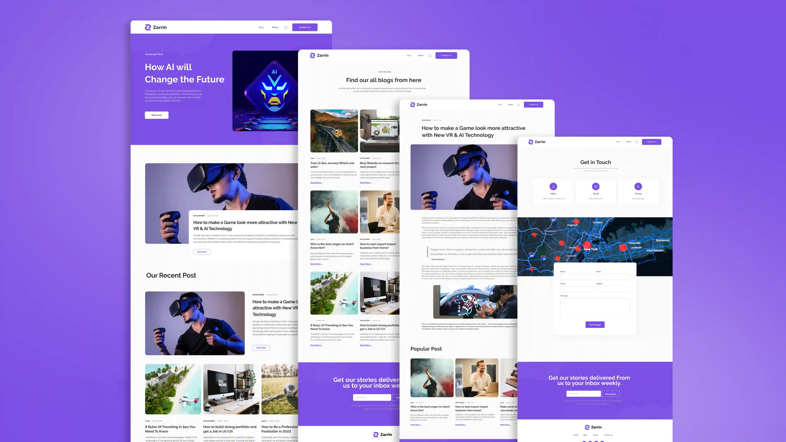

    
    <h1 style="color: white;">Zarrin</h1>

    <svg width="32" height="32" viewBox="-10.5 -9.45 21 18.9" fill="none" xmlns="http://www.w3.org/2000/svg" class="uwu-hidden mt-4 mb-3 text-brand dark:text-brand-dark w-24 lg:w-28 self-center text-sm me-0 flex origin-center transition-all ease-in-out"><circle cx="0" cy="0" r="2" fill="currentColor"></circle><g stroke="currentColor" stroke-width="1" fill="none"><ellipse rx="10" ry="4.5"></ellipse><ellipse rx="10" ry="4.5" transform="rotate(60)"></ellipse><ellipse rx="10" ry="4.5" transform="rotate(120)"></ellipse></g></svg>
    <svg xmlns="http://www.w3.org/2000/svg" x="0px" y="0px" width="32" height="32" viewBox="0 0 48 48">
        <path fill="#9575cd" d="M44.86,9.976L25.023,45.448c-0.41,0.732-1.462,0.737-1.878,0.008L2.915,9.979 C2.462,9.185,3.141,8.223,4.041,8.384l19.859,3.55c0.127,0.023,0.256,0.022,0.383-0.001l19.443-3.544 C44.623,8.225,45.305,9.18,44.86,9.976z"></path><path fill="#fbc02d" d="M33.574,3.01L19.019,5.862c-0.239,0.047-0.416,0.25-0.431,0.493l-0.895,15.121 c-0.021,0.356,0.306,0.633,0.654,0.552l4.052-0.935c0.379-0.087,0.722,0.246,0.644,0.628l-1.204,5.895 c-0.081,0.397,0.291,0.736,0.679,0.618l2.503-0.76c0.388-0.118,0.761,0.222,0.679,0.62l-1.913,9.26 c-0.12,0.579,0.651,0.895,0.972,0.398l0.215-0.332l11.86-23.669c0.199-0.396-0.144-0.848-0.579-0.764l-4.171,0.805 c-0.392,0.076-0.725-0.289-0.615-0.673l2.722-9.438C34.301,3.299,33.967,2.933,33.574,3.01z"></path>
    </svg>

Zarrin یک وبسایت وبلاگ ساده و مدرن است که با React ساخته شده است. این پروژه به شما امکان می‌دهد تا پست‌های وبلاگ را مشاهده کنید و تجربه‌ی کاربری روان و جذابی داشته باشید.

## 🖼️ اسکرین‌شات‌ها (Screenshots)

## ✨ امکانات (Features)

- React Router
- طراحی واکنش‌گرا (Responsive Design)
- استفاده از کامپوننت‌های تابعی و هوک‌ها
- tailwindcss برای استایل‌دهی

